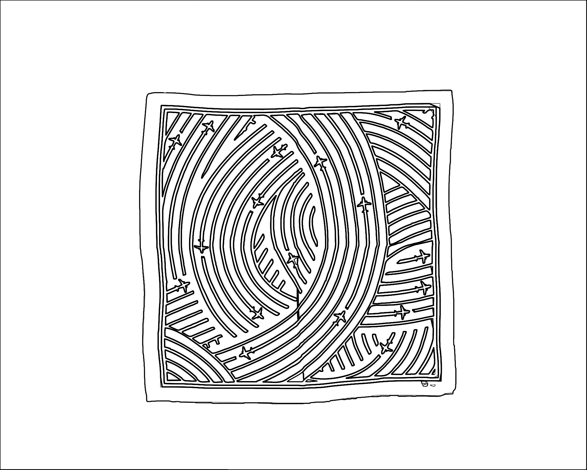

# go-colouringbook

Go package for generating "coloring book" style images.

## Documentation

Documentation is incomplete at this time. Until then take a look at [cmd/outline/main.go](cmd/outline/main.go) for basic usage guidelines.

For background, consult the [Coloring Books Pages For the SFO Museum Aviation Collection ](https://millsfield.sfomuseum.org/blog/2023/12/18/coloringbook/) blog post.

## Tools

### outline

```
$> ./bin/outline -h
  -contour-format string
    	The format for the final image contour. Valid options are: png, svg. (default "png")
  -contour-iteration int
    	The number of iterations to perform generating an image contour. (default 8)
  -contour-scale float
    	The scale factor of the final image contour. (default 1)
  -contour-smoothing
    	Enable line-smoothing of contours using Chaikin's algorithm. (default true)
  -contour-smoothing-close
    	Automatically close paths when performing line smoothing. (default true)
  -contour-smoothing-iterations int
    	The number of iterations to perform when doing line smoothing. Note: More than 6 iterations often results in blank images. (default 4)
  -infile string
    	The path to the image you want to generate an outline for.
  -outfile string
    	The path to the final image that has been outlined.
  -path-batik string
    	The path to the Java Batik SVG raterizer JAR file. (default "/usr/local/src/batik-1.17/batik-rasterizer-1.17.jar")
  -use-batik
    	Use the Java Batik SVG raterizer. (default true)
  -vtracer-precision int
    	Number of significant bits (color precision) to use in an RGB channel. (default 6)
  -vtracer-speckle int
    	Discard patches smaller than X px in size (default 8)
```

For example:

```
$> ./bin/outline -infile fixtures/1762830785-scarf.jpg -outfile fixtures/1762830785-scarf-o.png
```

Which would read this file:


And produce this file:



## See also

* https://www.visioncortex.org/vtracer/
* https://xmlgraphics.apache.org/batik/
* https://github.com/fogleman/contourmap
* https://github.com/aaronland/go-chaikin